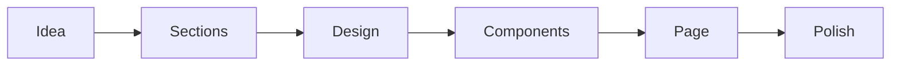

**Date:** 01-01-2026  
**Platform:** GitHub  
**Issue:** #182579  
**Link:** https://github.com/orgs/community/discussions/182579#discussion-9277011
**Topic:** _Designing beautiful landing page - Tips & Tricks_   
**Answer:** 
```
Hey Senne,
Don’t overthink it.

1. Decide **what the page should say and do**
2. Split the page into **sections** (hero, features, CTA, footer)
3. Design those sections in Figma (or any tool)
4. Turn each section into a **component**
5. Assemble components into the page
6. Add **styling first**, animation last

Think in **sections → components → page**, not pixels.

Backgrounds, shadows, and effects are just tools to separate sections.
Animations are optional polish, not structure.

---

### Tiny Mermaid diagram (.mmd)
```



```
That’s it.

Note: Keep researching and now that we live in the era of AI, I believe learning has become a lot more easier than it was ever before, ask precise questions, don't just copy paste, and ask even the most stupid questions, you never know what's gonna best work for you.

Cheers
```
